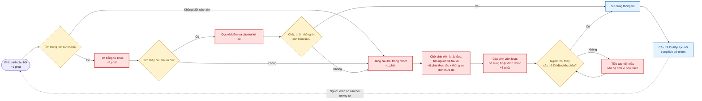

# Phase 1 — Individual Scan

**Học viên:** Đồng Đại Huy

**Mã học viên:** 2A202601901

**Bối cảnh scan:** trải nghiệm sử dụng các dịch vụ trong trường như đăng ký học tập, tra cứu thông tin, thư viện, thủ tục hành chính và hỗ trợ kỹ thuật.

## Cách tôi thực hiện

Tôi bắt đầu từ các lần sinh viên cần tìm thông tin hoặc hoàn thành một thủ tục trong trường, sau đó quan sát theo bốn lăng kính: lặp lại, tốn thời gian, AI có thể tốt hơn và pain từ người khác. Ở phase này, tôi chỉ mô tả vấn đề, người chịu ảnh hưởng và dấu hiệu có thể đo; chưa chọn giải pháp hay mặc định rằng mọi vấn đề đều cần AI.

Do chưa có time log hoặc khảo sát được lưu trong repo, các con số bên dưới là **ước tính ban đầu cần đối chiếu lại bằng nhật ký cá nhân hoặc hỏi nhanh thành viên nhóm** trước khi dùng làm baseline chính thức.

## Bảng scan rộng

|   # | Lăng kính                             | Problem quan sát được                                                                                                                                       | Ai chịu ảnh hưởng?                               | Dấu hiệu thật / cách đối chiếu                                                                                                                            |
| --: | ------------------------------------- | ----------------------------------------------------------------------------------------------------------------------------------------------------------- | ------------------------------------------------ | --------------------------------------------------------------------------------------------------------------------------------------------------------- |
|   1 | Lặp lại, tốn thời gian                | Trước mỗi kỳ đăng ký học, sinh viên phải tự đối chiếu chương trình đào tạo, học phần tiên quyết, lịch học và số tín chỉ để chọn lớp không bị xung đột.      | Tôi, sinh viên và cố vấn học tập                 | Ước tính phải mở 3–4 nguồn và mất 30–60 phút cho một phương án đăng ký; đối chiếu bằng số lần đổi phương án hoặc gặp cảnh báo trùng lịch/thiếu điều kiện. |
|   2 | Tốn thời gian, pain từ người khác     | Thông báo về lịch học, lịch thi hoặc đổi phòng nằm ở nhiều kênh nên sinh viên khó biết thông tin nào mới nhất.                                              | Sinh viên, giảng viên và cán bộ lớp              | Ước tính cần kiểm tra 2–3 kênh trước một buổi học; đo số trường hợp hỏi lại trong nhóm lớp, đến nhầm phòng hoặc biết thay đổi muộn.                       |
|   3 | AI có thể tốt hơn                     | Khi cần làm một thủ tục như xin giấy xác nhận sinh viên, bảng điểm hoặc bảo lưu, sinh viên khó xác định đúng biểu mẫu, giấy tờ, nơi nộp và thời gian xử lý. | Sinh viên và cán bộ phòng hành chính             | Mỗi loại thủ tục có hướng dẫn riêng; đo thời gian tìm hiểu, số lần phải hỏi lại và tỷ lệ hồ sơ phải bổ sung giấy tờ.                                      |
|   4 | Lặp lại, pain từ người khác           | Những câu hỏi giống nhau về học phí, đăng ký học, lịch thi, thủ tục hành chính và quy chế được hỏi lại nhiều lần trong nhóm học tập.                        | Sinh viên, thầy cô phụ trách vấn đề              | Có thể tìm trong lịch sử nhóm chat theo các từ khóa thường gặp và đếm số câu hỏi trùng trong một tháng.                                                   |
|   5 | Tốn thời gian                         | Khi cần tìm một cuốn sách hoặc tài liệu, sinh viên phải tra cứu danh mục rồi tự xác định cơ sở, tầng, khu vực và tình trạng còn sách.                       | Sinh viên sử dụng thư viện và nhân viên thư viện | Ước tính mất 10–20 phút cho một lần tìm; đối chiếu bằng thời gian từ lúc bắt đầu tra cứu đến khi tìm thấy hoặc xác nhận không có tài liệu.                |
|   6 | AI có thể tốt hơn, pain từ người khác | Khi cổng thông tin sinh viên, Wi-Fi hoặc tài khoản trường gặp lỗi, sinh viên không biết lỗi thuộc hệ thống nào và cần liên hệ đúng bộ phận nào.             | Sinh viên và bộ phận hỗ trợ kỹ thuật             | Dấu hiệu là phải thử nhiều kênh hoặc chuyển tiếp yêu cầu; đo thời gian đến khi liên hệ đúng nơi và số lượt trao đổi trước khi xử lý.                      |
|   7 | Lặp lại, tốn thời gian                | Sinh viên phải nhập lại các thông tin cá nhân giống nhau trên nhiều biểu mẫu đăng ký dịch vụ hoặc hoạt động của trường.                                     | Sinh viên và đơn vị tiếp nhận biểu mẫu           | Đếm số trường dữ liệu bị lặp giữa 3–5 biểu mẫu gần nhất và thời gian hoàn thành mỗi biểu mẫu; ghi nhận số lỗi nhập sai phải sửa.                          |
|   8 | Pain từ người khác                    | Sinh viên khó biết một phòng tự học, phòng máy hoặc không gian sinh hoạt có đang trống và có cần đăng ký trước hay không.                                   | Sinh viên, nhóm học tập và đơn vị quản lý phòng  | Dấu hiệu là phải đi kiểm tra trực tiếp hoặc hỏi trong nhóm; đo số lần không tìm được chỗ và thời gian tìm phòng trong giờ cao điểm.                       |
|   9 | Tốn thời gian, AI có thể tốt hơn      | Thông tin về học bổng, cuộc thi, hội thảo và hoạt động ngoại khóa phân tán; sinh viên khó lọc cơ hội phù hợp với ngành, khóa học và điều kiện cá nhân.      | Sinh viên và đơn vị tổ chức                      | Ước tính cần 20–30 phút mỗi tuần để đọc nhiều thông báo; đo số cơ hội phù hợp được phát hiện sau hạn hoặc bị bỏ qua vì không rõ điều kiện.                |
|  10 | Lặp lại, pain từ người khác           | Khi phản ánh cơ sở vật chất như máy chiếu, điều hòa, điện hoặc bàn ghế bị hỏng, sinh viên không rõ kênh báo, người phụ trách và trạng thái xử lý.           | Sinh viên, giảng viên và bộ phận cơ sở vật chất  | Đo thời gian từ lúc phát hiện đến khi yêu cầu được tiếp nhận, số lần phải báo lại và tỷ lệ phản ánh không có cập nhật trạng thái.                         |

## Nhận xét sau khi scan

- Tôi tìm được **10 vấn đề**, vượt yêu cầu tối thiểu 5 và bao phủ cả bốn lăng kính.
- Các vấn đề xuất hiện nhiều nhất quanh ba cụm: tra cứu thông tin, hoàn thành thủ tục và tìm đúng đơn vị hỗ trợ.
- Nhiều pain đến từ thông tin phân tán, quy trình chưa rõ và việc thiếu cập nhật trạng thái; không nhất thiết do thiếu một công cụ AI.
- Bước tiếp theo cần kiểm chứng tần suất và thời gian của từng vấn đề, rồi mới chọn Top 3 ở Phase 2.

## Kế hoạch kiểm chứng nhanh số liệu

Trong một tuần, tôi sẽ ghi lại các lần tra cứu thông báo, sử dụng thư viện, tìm phòng và liên hệ bộ phận hỗ trợ. Đồng thời, tôi sẽ tìm trong lịch sử nhóm lớp các câu hỏi lặp lại về lịch học, đăng ký học và thủ tục; sau đó hỏi nhanh 2–3 sinh viên xem vấn đề nào xảy ra thường xuyên nhất. Kết quả này sẽ được dùng để thay các ước tính ban đầu trước khi chốt Problem Cards.

---

# Phase 2 — Top 3 Problem Cards và draft workflow

Các con số thời gian trong Phase 2 là baseline ước tính từ Phase 1. Chúng cần được thay bằng time log, lịch sử tin nhắn hoặc phỏng vấn nhanh trước khi trở thành bằng chứng chính thức.

## Chọn Top 3

| Rank | Problem                                                                            | Vì sao chọn                                                                                                                       | Điều còn chưa chắc                                                                                             |
| ---: | ---------------------------------------------------------------------------------- | --------------------------------------------------------------------------------------------------------------------------------- | -------------------------------------------------------------------------------------------------------------- |
|    1 | Sinh viên phải tự đối chiếu nhiều điều kiện khi đăng ký học                        | Tác động lớn vào mỗi kỳ đăng ký; workflow và lỗi đầu ra rõ; có thể đo thời gian lập phương án, số xung đột và số lần phải đổi lớp | Dữ liệu chương trình đào tạo, tiên quyết và lịch mở lớp có đầy đủ, nhất quán và truy cập được hay không        |
|    2 | Khó xác định đúng quy trình cho thủ tục hành chính sinh viên                       | Actor và workflow rõ; bottleneck nằm ở bước tìm đúng hướng dẫn; có thể đo thời gian tra cứu và tỷ lệ hồ sơ đầy đủ ngay lần đầu    | Tần suất của từng loại thủ tục và tỷ lệ hồ sơ thực tế phải bổ sung                                             |
|    3 | Câu hỏi về học phí, đăng ký học, lịch thi và thủ tục bị hỏi lại trong nhóm học tập | Pain lặp lại ở cả người hỏi và người trả lời; có log tin nhắn để kiểm chứng; phạm vi có thể thu hẹp theo chủ đề                   | Bao nhiêu câu thực sự trùng, câu trả lời nào còn hiệu lực và ai chịu trách nhiệm xác nhận thông tin chính thức |

## Problem Card #1 — Lập phương án đăng ký học không xung đột

**Problem 1 câu:** Trước mỗi kỳ đăng ký học, sinh viên phải tự đối chiếu chương trình đào tạo, học phần tiên quyết, lịch mở lớp và giới hạn tín chỉ để lập phương án không xung đột, nên mất thời gian và dễ phải chọn lại.

**Actor:** Sinh viên chuẩn bị đăng ký học; cố vấn học tập là actor phụ hỗ trợ khi phương án chưa phù hợp.

**Thời điểm / bối cảnh:** Trước và trong đợt đăng ký học của mỗi học kỳ, đặc biệt khi nhiều lớp có lịch trùng hoặc số chỗ giới hạn.

**Current workflow ước tính:**

1. Mở chương trình đào tạo để xem các học phần còn thiếu.
2. Kiểm tra học phần tiên quyết/song hành và giới hạn tín chỉ.
3. Mở danh sách lớp dự kiến hoặc đang được mở.
4. Ghi lại mã lớp, lịch học và lịch thi của từng lựa chọn.
5. Tự so sánh để loại các lớp xung đột và cộng tổng tín chỉ.
6. Hỏi bạn bè hoặc cố vấn nếu điều kiện chưa rõ.
7. Đăng ký; nếu lớp đầy hoặc hệ thống báo lỗi thì lập lại phương án.

**Bottleneck:** Bước 2–5 — dữ liệu nằm ở nhiều bảng và sinh viên phải đối chiếu thủ công nhiều ràng buộc; ước tính mất 30–60 phút cho một phương án.

**Impact:** Sinh viên tốn thời gian, có thể đăng ký thiếu/thừa tín chỉ, trùng lịch hoặc bỏ lỡ lớp phù hợp. Cố vấn học tập phải giải đáp các trường hợp lặp lại. Mức tác động cần được kiểm chứng bằng số lần đổi phương án và số cảnh báo đăng ký.

**Success metric:** Giảm thời gian lập một phương án từ 30–60 phút xuống dưới 15 phút; phát hiện 100% xung đột lịch và vi phạm tiên quyết có trong dữ liệu thử nghiệm; không tự đăng ký hoặc thay đổi lựa chọn khi sinh viên chưa xác nhận.

**Non-AI alternative:** Một bộ lọc và rule engine đối chiếu tiên quyết, lịch học, lịch thi, số tín chỉ và số chỗ; hiển thị các tổ hợp hợp lệ để sinh viên tự chọn. Đây là phương án ưu tiên vì phần lớn ràng buộc có cấu trúc rõ.

**AI hypothesis:** AI chỉ hỗ trợ diễn giải yêu cầu bằng ngôn ngữ tự nhiên hoặc giải thích vì sao một phương án bị loại. Việc kiểm tra ràng buộc phải dựa trên rule và dữ liệu chính thức; AI không tự suy đoán môn tương đương hoặc tự đăng ký lớp.

**Quick gut:** Workflow kết hợp Rule, chưa cần Agent.

### Draft current workflow #1

```text
CURRENT STATE — ước tính 30–60 phút cho một phương án

[Xem học phần còn thiếu: 5']
→ [Kiểm tra tiên quyết/giới hạn tín chỉ: 10']  <-- bottleneck
→ [Ghi các lớp và lịch: 10']
→ [So xung đột + cộng tín chỉ: 15']            <-- bottleneck
→ [Hỏi để xác nhận: 10']
→ [Đăng ký]
→ [Lớp đầy/báo lỗi? Lập lại phương án: +20–40']
```

### Draft future workflow #1

```text
FUTURE STATE — mục tiêu dưới 15 phút cho một phương án

[Nạp dữ liệu CTĐT + lớp mở chính thức]
→ [Sinh viên chọn mục tiêu/số tín chỉ: 2']
→ [Rule lọc tiên quyết và xung đột: <1']
→ [Hiển thị phương án + lý do loại lớp: 1']
→ [Sinh viên so sánh và chọn: 8']               <-- human boundary
→ [Kiểm tra lại trên hệ thống đăng ký: 2']
→ [Sinh viên xác nhận đăng ký]                  <-- human boundary

Fallback: Dữ liệu thiếu, điều kiện ngoại lệ hoặc lớp vừa đầy
→ cảnh báo chưa thể kết luận và chuyển sang cố vấn/hệ thống chính thức.
```

## Problem Card #2 — Tìm đúng quy trình thủ tục hành chính

**Problem 1 câu:** Sinh viên cần làm thủ tục hành chính phải tìm và đối chiếu nhiều nguồn để biết đúng biểu mẫu, giấy tờ, nơi nộp và thời gian xử lý, nên dễ nộp thiếu hoặc phải hỏi lại.

**Actor:** Sinh viên cần xin giấy xác nhận sinh viên, bảng điểm, bảo lưu hoặc thực hiện một thủ tục học vụ; cán bộ tiếp nhận hồ sơ là actor phụ bị ảnh hưởng.

**Thời điểm / bối cảnh:** Khi sinh viên phát sinh nhu cầu hành chính, thường gần hạn nộp hồ sơ học bổng, thực tập hoặc giấy tờ cá nhân.

**Current workflow ước tính:**

1. Xác định tên thủ tục cần làm.
2. Tìm hướng dẫn trên website, cổng sinh viên hoặc nhóm học tập.
3. So sánh các hướng dẫn để xác định phiên bản còn hiệu lực.
4. Hỏi bạn bè, lớp trưởng hoặc phòng phụ trách để xác nhận.
5. Tải biểu mẫu, chuẩn bị giấy tờ và điền thông tin.
6. Nộp hồ sơ trực tuyến hoặc trực tiếp.
7. Nếu thiếu hoặc sai, nhận phản hồi rồi bổ sung và nộp lại.

**Bottleneck:** Bước 2–4 — xác định nguồn chính thức và checklist đúng cho trường hợp cụ thể; ước tính mất 20–35 phút mỗi thủ tục, chưa tính thời gian chờ phản hồi.

**Impact:** Sinh viên mất thời gian tra cứu, có nguy cơ trễ hạn hoặc phải đi lại. Cán bộ tiếp nhận phải trả lời câu hỏi lặp lại và xử lý hồ sơ thiếu. Mức ảnh hưởng cần được kiểm chứng bằng tỷ lệ hồ sơ bổ sung và số câu hỏi về cùng một thủ tục.

**Success metric:** Giảm thời gian tìm đúng hướng dẫn từ 20–35 phút xuống dưới 10 phút; ít nhất 90% người thử nghiệm chuẩn bị đủ checklist ngay lần đầu; không làm tăng số hồ sơ bị trả lại vì hướng dẫn sai.

**Non-AI alternative:** Chuẩn hóa một trang danh mục thủ tục có bộ lọc, checklist, chủ sở hữu nội dung, ngày cập nhật và thông tin liên hệ. Cách này có thể đã đủ nếu số thủ tục và nhánh điều kiện ít.

**AI hypothesis:** Nếu hướng dẫn có nhiều nhánh và nằm trong nguồn chính thức, AI có thể hỏi vài câu làm rõ rồi tìm đúng mục và diễn giải checklist. AI chỉ hỗ trợ tra cứu, không tự phê duyệt hồ sơ hoặc khẳng định thông tin ngoài nguồn; sinh viên vẫn phải kiểm tra hướng dẫn gốc.

**Quick gut:** Workflow; chỉ cân nhắc AI cho bước tìm kiếm và diễn giải nếu bộ lọc/rule không đủ.

### Draft current workflow #2

```text
CURRENT STATE — ước tính 45–70 phút thao tác

[Xác định nhu cầu: 3']
→ [Tìm trên nhiều kênh: 15']
→ [Đối chiếu phiên bản/điều kiện: 10']  <-- bottleneck
→ [Hỏi để xác nhận: 10']               <-- bottleneck
→ [Chuẩn bị hồ sơ: 20']
→ [Nộp: 5']
→ [Thiếu/sai? Bổ sung: +30' hoặc một lần đi lại]
```

### Draft future workflow #2

```text
FUTURE STATE — mục tiêu 25–35 phút thao tác

[Chọn nhu cầu: 1']
→ [Trả lời câu hỏi điều kiện: 2']
→ [Nhận checklist + link nguồn chính thức: 1']
→ [Sinh viên kiểm tra nguồn/ngày cập nhật: 3']  <-- human boundary
→ [Chuẩn bị hồ sơ: 20']
→ [Kiểm tra đủ trường bắt buộc: 2']
→ [Nộp: 3']
→ [Cán bộ quyết định tiếp nhận/phê duyệt]       <-- human boundary

Fallback: Không xác định được trường hợp hoặc nguồn đã cũ
→ hiển thị đầu mối phụ trách và yêu cầu cán bộ xác nhận.
```

## Problem Card #3 — Câu hỏi dịch vụ trường bị hỏi lại trong nhóm học tập

**Problem 1 câu:** Các câu hỏi giống nhau về quy chế, thủ tục hành chính, review môn, review giáo viên được hỏi lại trong nhóm học tập vì câu trả lời cũ khó tìm hoặc không rõ còn hiệu lực tại thời điểm hỏi hay không.

**Actor:** Sinh viên cần thông tin; Sinh viên giải đáp.

**Thời điểm / bối cảnh:** Đặc biệt nhiều khi đến các mốc đóng học phí, đăng ký học, thi cuối kỳ.

**Current workflow ước tính:**

1. Sinh viên phát sinh một câu hỏi thắc mắc.
2. Sinh viên thử tìm trong lịch sử nhóm bằng từ khóa hoặc đăng câu hỏi ngay nếu không biết cách tìm.
3. Nếu tìm thấy câu trả lời cũ, sinh viên đọc và kiểm tra nhưng không chắc thông tin còn hiệu lực.
4. Đăng lại câu hỏi trong nhóm.
5. Sinh viên lướt đọc thấy và vào trả lời, các sinh viên khác có thể bổ sung hoặc đính chính nếu thông tin khác nhau.
6. Sinh viên hỏi tự đánh giá câu trả lời và nếu chưa chắc, tiếp tục hỏi hoặc liên hệ đơn vị phụ trách.
7. Câu trả lời tiếp tục trôi và quy trình lặp lại với người khác.

**Bottleneck:** Bước 2–7 — Người hỏi khó tìm và xác định hiệu lực của câu trả lời cũ; người trả lời phải lặp lại việc tìm nguồn, kiểm tra và giải đáp. Ngoài 10–20 phút thao tác, người hỏi còn có thời gian chờ chưa được đo.

**Impact:** Người hỏi phải chờ và có thể dùng thông tin cũ; người thường trả lời bị gián đoạn; nhóm có thêm tin nhắn trùng làm thông tin quan trọng tiếp tục khó tìm. Mức độ cần được kiểm chứng bằng lịch sử tin nhắn theo từng chủ đề.

**Success metric:** Giảm thời gian tìm câu trả lời từ 10–20 phút xuống dưới 3 phút; giảm ít nhất 50% số câu hỏi trùng; 100% câu trả lời về quy định có link nguồn và ngày cập nhật; không tăng số câu trả lời sai hoặc hết hiệu lực.

**Non-AI alternative:** Tạo FAQ được ghim, chia theo chủ đề, có người phụ trách và ngày rà soát; hướng dẫn thành viên tìm kiếm trước khi hỏi. Phương án này có thể đủ nếu số câu hỏi phổ biến ít và ổn định.

**AI hypothesis:** AI có thể nhận biết các cách hỏi khác nhau nhưng cùng ý và tìm câu trả lời từ FAQ, tài liệu quy chế, thông báo từ nhà trường. AI phải kèm nguồn và ngày cập nhật, không suy đoán khi thiếu dữ liệu và chuyển câu chưa chắc chắn cho người phụ trách.

**Quick gut:** Workflow có AI hỗ trợ semantic search/RAG, chưa cần Agent. Với quy chế và thủ tục, AI tìm thông tin từ nguồn đã duyệt và luôn kèm nguồn; với review môn hoặc giảng viên, AI chỉ tìm hoặc tóm tắt các chia sẻ có sẵn và phải ghi rõ đây là ý kiến chủ quan. Sinh viên vẫn tự đánh giá, còn trường hợp chưa chắc chắn được chuyển cho con người.

### Draft current workflow #3



> **Điểm nghẽn:** Các bước từ tìm kiếm đến kiểm tra, hỏi lại, chờ phản hồi và đính chính. Tổng thời gian thao tác ước tính 10–20 phút/câu; thời gian chờ phản hồi chưa được đo.

### Draft future workflow #3

```mermaid
flowchart LR
    A([Sinh viên đặt câu hỏi<br/>< 1 phút]) --> B[Semantic search nhận biết<br/>các cách hỏi cùng ý<br/>< 1 phút]
    B --> C{Phân loại nội dung}

    C -->|Quy chế / thủ tục| D[Tìm trong FAQ, quy chế và<br/>thông báo đã được duyệt]
    D --> E{Nguồn còn hiệu lực,<br/>đủ và nhất quán?}
    E -->|Có| F[Trả lời kèm link nguồn<br/>và ngày cập nhật]
    E -->|Không| K[Thông báo chưa thể trả lời<br/>và không tự suy đoán]

    C -->|Review môn / giảng viên| G[Tìm hoặc tóm tắt<br/>các chia sẻ có sẵn]
    G --> H[Gắn nhãn<br/>“Ý kiến chủ quan”]

    F --> I[Sinh viên mở nguồn,<br/>kiểm tra và tự đánh giá<br/>~1 phút]
    H --> I
    I --> J{Thông tin đã đủ<br/>và đáng tin cậy?}
    J -->|Có| N([Hoàn tất<br/>mục tiêu dưới 3 phút])
    J -->|Không| K

    K --> L[Chuyển cho người phụ trách]
    L --> M[Người phụ trách xác nhận<br/>hoặc cung cấp câu trả lời mới]
    M --> O[Bổ sung vào FAQ<br/>có phiên bản và ngày rà soát]
    O -. Dùng cho câu hỏi sau .-> B

    classDef ai fill:#e8f5e9,stroke:#2e7d32,stroke-width:1.5px,color:#17451b;
    classDef decision fill:#fff3cd,stroke:#b8860b,stroke-width:1.5px,color:#5f4500;
    classDef human fill:#e3f2fd,stroke:#1565c0,stroke-width:2px,color:#0d3c73;
    classDef fallback fill:#ffe0e0,stroke:#c62828,stroke-width:2px,color:#7f0000;
    classDef outcome fill:#ede7f6,stroke:#5e35b1,stroke-width:1.5px,color:#311b69;
    class B,D,F,G,H,O ai;
    class C,E,J decision;
    class I,L,M human;
    class K fallback;
    class N outcome;
```



> **Human boundary:** Sinh viên vẫn kiểm tra nguồn và tự đánh giá câu trả lời. Người phụ trách chỉ tiếp nhận khi nguồn thiếu, hết hiệu lực, mâu thuẫn hoặc sinh viên chưa đủ chắc chắn.

## Card muốn pitch nhất

**Card tôi muốn pitch nhất:** Problem Card #3 — Câu hỏi dịch vụ trường bị hỏi lại trong nhóm học tập.

**Vì sao:** Problem này xảy ra lặp lại, ảnh hưởng trực tiếp đến cả sinh viên cần thông tin và sinh viên thường xuyên giải đáp. Tác động có thể kiểm chứng bằng lịch sử tin nhắn theo từng chủ đề, thời gian tìm câu trả lời và số câu hỏi trùng. Phạm vi cũng có thể thu hẹp vào một số chủ đề xuất hiện nhiều trong các mốc đóng học phí, đăng ký học và thi cuối kỳ để thử nghiệm semantic search/RAG với nguồn đã duyệt.

**Câu hỏi tôi muốn nhóm challenge:** Một FAQ được ghim và có người rà soát định kỳ đã đủ giảm câu hỏi trùng hay cần semantic search/RAG để nhận biết các cách hỏi khác nhau? Làm thế nào để bảo đảm câu trả lời về quy định luôn có nguồn, ngày cập nhật và không sử dụng thông tin đã hết hiệu lực?
